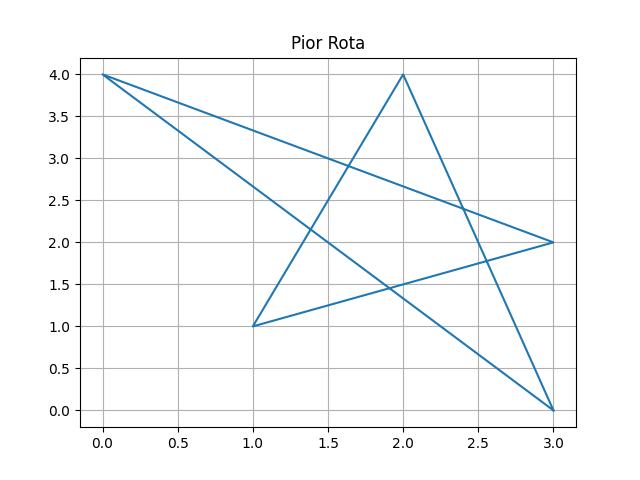
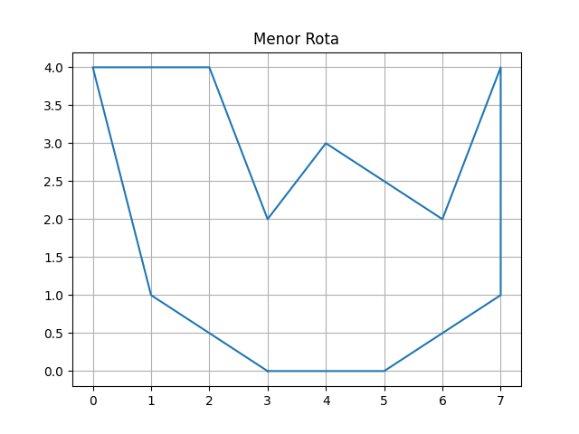

# PSI-II-BSI

Sobre o projeto:
-
O projeto tem como intuito calcular a melhor rota possível para entrega de comida da aplicação 
no qual foi nomeada de FlyFood. Nele foi buscado utilizar princípios matemáticos como permutação
e calculo da distância de dois pontos que não podem se cruzar para que fosse possível o melhor caminho.

Como compilar o código:
-
**python3 main.py entrada.txt** 

No arquivo *todasEntradas.txt* pode ser encontrado várias opções que servem como entrada
no aquivo *entrada.txt* nele também diz quando o código não funciona mais com determinada entrada.


#Exemplo em gráficos

Demonstraçã da menor rota e melhor para a seguinte entrada:
```
4 5
0 0 0 0 D
0 A 0 0 0
0 0 0 0 C
R 0 B 0 0
```
Menor rota:
> A D C B


Pior rota:
> C A B D 



Demonstraçã da menor rota e melhor para a seguinte entrada:
```
8 5
0 0 0 0 D
0 A 0 0 0
0 0 0 0 C
R 0 B 0 0
0 0 0 F 0
I 0 0 0 0
0 0 J 0 0
0 N 0 0 K
```

Menor rota: 
> I J N K F C D A B 



Pior rota:
> F A J C I D N B K 


#Resultados

Como pode ter sido observado, as piores rotas são quando os pontos tendem a cruzar mais os caminhos
e o melhor quando evitam haver o cruzamento entre eles. 